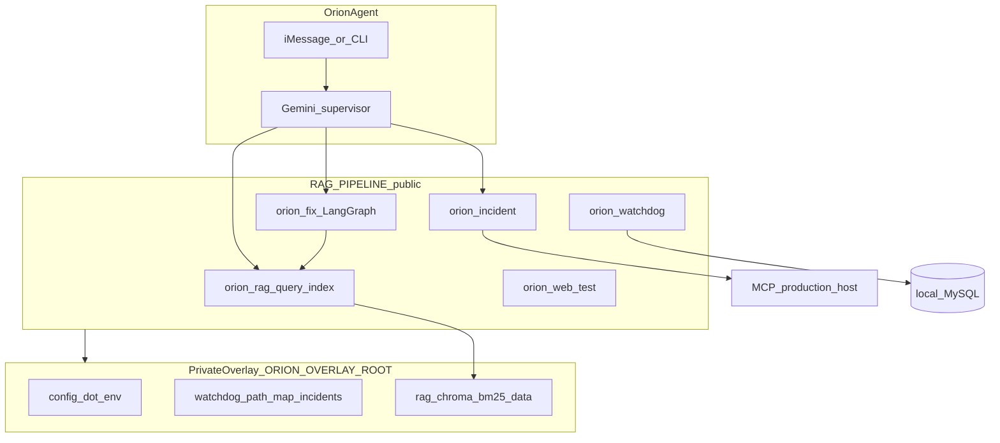
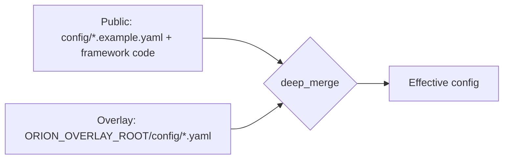
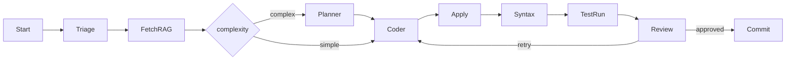

# Architecture Overview

Orion RAG Pipeline is a local operator stack for the **Orion** OpenClaw agent: RAG indexing and retrieval, LangGraph-based code repair, SQL watchdog, incident supervision, and web smoke testing. Production secrets and operator data live in a **private overlay**; this repo ships the reusable framework.

Design rationale: [DECISIONS.md](./DECISIONS.md). RightsTune reference: [EXAMPLES-rightstune.md](./EXAMPLES-rightstune.md).

## System diagram

## Two-layer model

Overlay discovery: `ORION_OVERLAY_ROOT` → `features.yaml` `paths.overlay_root` → `~/.openclaw/local/rag-pipeline/` if present → pure-public mode.

## CLI modules

| CLI | Module | Feature flag | Purpose |
|-----|--------|--------------|---------|
| `bin/orion-rag-index` | `rag/` | `features.rag` | Build Chroma + BM25 indexes |
| `bin/orion-rag-query` | `rag/` | `features.rag` | Retrieval for questions |
| `bin/orion-rag-eval` | `rag/` | `features.rag` | Recall evaluation |
| `bin/orion-fix` | `codeflow/` | `features.langgraph_multiagent` | LangGraph auto-fix with RAG |
| `bin/orion-code` | `codeflow/` | `features.langgraph_multiagent` | Code worker entry |
| `bin/orion-db` | `db/` | `features.local_mysql` | Local MySQL queries |
| `bin/orion-incident` | `incidents/` | `features.incidents` | MCP poll, remediate, notify |
| `bin/orion-watchdog` | `watchdog/` | `features.watchdog` | SQL validation checks |
| `bin/orion-golden-test` | `golden/` | (manifest) | Fixture regression tests |
| `bin/orion-web-test` | `web/` | `features.local_web` | Playwright smoke pages |

## Data flows

### Indexing

REPOS and docs → indexers → redaction → Chroma + BM25 sidecar + manifest → overlay `rag/`.

### Query

Question → intent heuristics → collection routing → vector search (optional BM25 hybrid) → ranked chunks.

### Auto-fix

### Monitoring

| Path | CLI | Source |
|------|-----|--------|
| Reactive | `orion-incident poll` | MCP production host |
| Proactive | `orion-watchdog run` | Local MySQL |

## Configuration

Layered merge and file map: [CONFIG.md](./CONFIG.md). Feature flags in `config/features.yaml`.

## Code entry points

- `common/paths.py` — overlay and path resolution
- `common/config.py` — features and `.env`
- `rag/retrieve.py` — retrieval API
- `codeflow/graph.py` — LangGraph workflow
- `incidents/fsm.py` — incident state
- `watchdog/run.py` — watchdog runner
